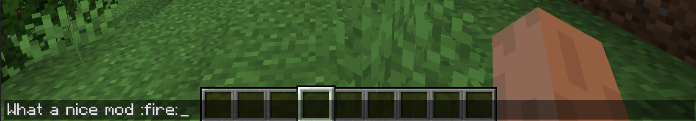
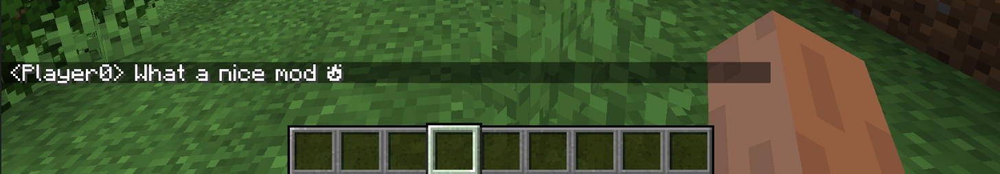

<h1 align="center">
Emoticon Chat
</h1>

---
A 1.18.2 fabric mod allowing players to write emojis in chat `:emoji: --> UTF-8`, simmilar to discord.

>Versions: 1.18+ Compatible (FABRIC)

## Typing emojis
Writing an emoji type surrounded by colons and then entering, converts it to emoji format.


```
:skull: -> ☠
:v: -> ✌
:heart: -> ❤
:tm: -> ™
:checkmark: -> ✓
:star: -> ★
:smile: -> ☻
:infinity -> ∞
:e: -> Ⓔ
:x: -> ✕
:tableflip -> (╯°□°）╯︵ ┻━
:fire: -> 🔥  
```




----
__EmoticonChat v1.0__

